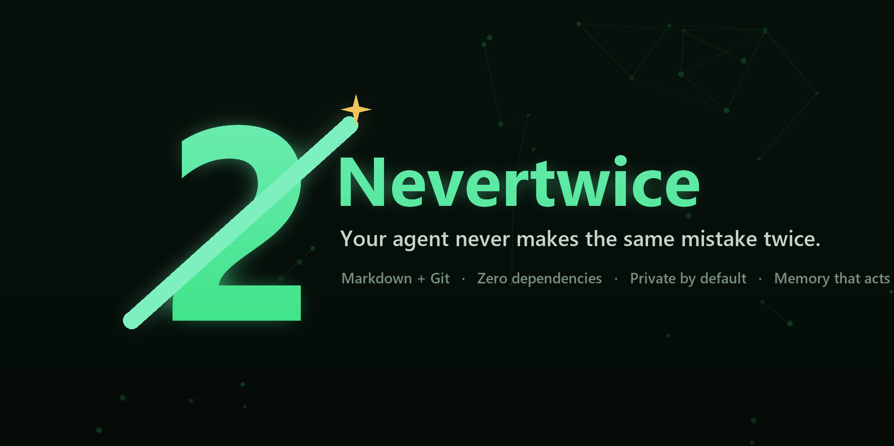
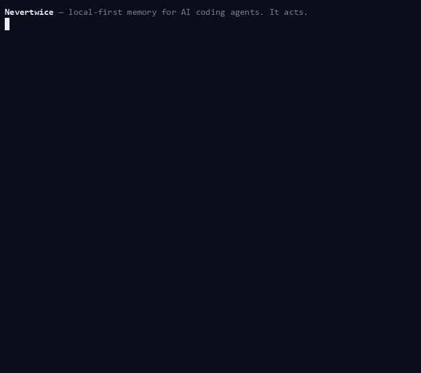

<div align="center">



# 🧠 Nevertwice

### Local-first memory for AI coding agents that catches the mistake before your agent repeats it.

*Your coding agent forgets everything when a session ends. Nevertwice remembers: the bug you hit
last week, the pattern that worked, the reason you picked Postgres over Mongo. Then it does what
other memory tools don't. Instead of padding every prompt with recalled text, it stays quiet until
it has something useful, then acts by catching the mistake before you repeat it. Memory that earns
its tokens.*

**No database. No server. No cloud. No API keys required. Zero pip dependencies. Works with every agent.**

<sub>Formerly **Anamnesis** — renamed 2026-07 (same project, same store, old env vars still work).</sub>

[](https://github.com/DonPlaton/nevertwice/actions/workflows/ci.yml)
[](https://github.com/DonPlaton/nevertwice/actions/workflows/codeql.yml)
[](https://github.com/DonPlaton/nevertwice/actions/workflows/scorecard.yml)
[](#install)
[-orange)](#why-nevertwice)
[](LICENSE)
[](#benchmarks)
[](#memory-that-acts)

```text
$ # days ago, a different session, your agent hit a CUDA OOM and Nevertwice recorded the lesson.
$ # now, a fresh agent, a new prompt:
$ python nevertwice/memory_search.py "training crashes out of gpu memory" myproject

⚠ 1 relevant lesson recalled (confidence 0.68):
  • [mistake] CUDA OOM at batch=64 on this GPU
    → lower batch size or enable gradient checkpointing; it recurred twice.
```

<sub>▶ See it live in 25 seconds: **`python examples/demo.py`** (any OS) or **`bash examples/demo.sh`** · recording a GIF: [docs/DEMO.md](docs/DEMO.md)</sub>

</div>

---

## The pitch

Every morning your agent starts from zero. It re-reads the same files, rediscovers the same
gotchas, and now and then repeats the exact mistake it made on Tuesday. You are paying tokens to
re-teach it your own project on a loop.

Nevertwice gives it a memory. It watches each session, distils the durable lessons into short
Markdown notes, commits them to git, and feeds the relevant ones back at the start of the next
session and again as you type each prompt. The agent stops re-learning and starts recollecting.

The part most memory tools get wrong is the store itself. Here it is just files. You can open it
in Obsidian, grep it, diff it, and copy the folder to move your agent's brain to another machine.
There is no vector database to run and no service to trust. Embeddings run locally on Ollama by
default, or on a single cloud key if you would rather not run a local model.

And it is not a toy. On the public LongMemEval benchmark, with the same local embedder for every
system, Nevertwice out-retrieves the funded hosted leaders (Mem0, LangMem, A-MEM) on every metric,
and you can reproduce that in one command. The numbers, and an honest account of what we tried and
cut to get there, are [below](#benchmarks).

Want more than coding memory? Flip on the opt-in **Brain layer** and the same captured sessions
self-wire into a knowledge graph of papers, methods, and datasets, tracking how your thinking on
each one evolved. It is *pull-only*, read on demand, so your token budget never notices it is there.

```bash
git clone https://github.com/DonPlaton/nevertwice && cd nevertwice
python install.py
```

`install.py` detects your backend, prints what it chose, and wires Claude Code. Your next session
starts with its memory already loaded. The five-minute walkthrough is in [QUICKSTART.md](QUICKSTART.md).

> **Why not Mem0, Zep, or Letta?** Those are a hosted service plus a vector database you ship your
> data to. Nevertwice is plain files on your disk that you can read, grep, and diff, and nothing
> leaves the machine by default. The honest, benchmarked comparison is [further down](#benchmarks).

## Memory that acts

Every other memory system is a better **library**. It retrieves text and injects it into the
prompt, taxing every single turn. We measured that axis to its end and found it is
[reader-bound and commoditizing](nevertwice/research/QA_ACCURACY.md): the LLM, not the memory, is
the variable. So Nevertwice does something no other memory does. It treats memory as a set of
**token-budgeted interventions** that stay silent until they have something worth saying.

- **Guards (A).** A past mistake compiles into an executable check that fires *before* you repeat
  it, at **zero context tokens until it fires**. The design is Popperian: a guard is advisory until
  corroborated, retires itself on false positives, and is always overridable. Memory proposes,
  reality disposes, and the agent is never boxed in.
- **Anticipation (B).** Predicts the failure your current plan is heading toward by resemblance
  to past ones, and surfaces *one* precise warning. Spend is proportional to risk, not paid per turn.
- **Counterfactual (C).** *"What breaks if I change X?"* answered from an induced causal graph in
  a few lines rather than an episode dump, at about **7× fewer tokens** than recalling every
  related note.

These are **measured on real tasks**, with the harness to reproduce each one:

| claim | result | evidence |
|---|---|---|
| a fired guard changes a real model's output | real error rate **0.36 → 0.05 (−86%)** on DeepSeek | [LIVE_VALIDATION.md](nevertwice/research/LIVE_VALIDATION.md) |
| memory that acts vs always-inject | same error-prevention for **~31× fewer tokens**, a *net* token saving | [ACTIVE_MEMORY.md](nevertwice/research/ACTIVE_MEMORY.md) |
| answer-accuracy on the standard benchmark | **0.788** LongMemEval-oracle (open reasoner) | [QA_ACCURACY.md](nevertwice/research/QA_ACCURACY.md) |
| retrieval vs the funded leaders | R@5 **0.80** › Mem0 0.76, one shared embedder | [COMPARISON.md](docs/COMPARISON.md) |

All three axes are on the Python API **and** the MCP server, so this works on **every agent**:
Claude Code, Cursor, Cline, Codex, Zed, and anything else that speaks MCP or writes logs to disk
([INTEGRATIONS.md](docs/INTEGRATIONS.md)). The moat isn't a better database. It's a memory that
*acts* and costs almost nothing until it does.

## Why Nevertwice

|  | Nevertwice | Mem0 / Zep / Letta / Cognee / memanto / Hindsight |
|---|---|---|
| **Acts, not just recalls** | ✅ guards + anticipation + counterfactual, **0 tokens until they fire** | ✗ retrieve-and-inject only (taxes every turn) |
| **Runs** | your machine, local files | a service, vector DB, or cloud (memanto: closed engine) |
| **Store format** | human-readable Markdown + Git | opaque DB rows and embeddings |
| **Dependencies** | **0** Python packages (stdlib core), local Ollama for embeddings (or an optional cloud embedder) | many, usually a server plus a DB |
| **Your data leaves the machine?** | **never** by default (local embeddings; cloud embedder is opt-in) | usually, via cloud APIs |
| **Auto-capture** | ✅ native for Claude Code, always-on daemon for the rest | manual API calls |
| **Knowledge graph** | ✅ entity + typed-relation graph over the Markdown, traversable, no DB | a separate graph database (Neo4j / FalkorDB) |
| **Open in Obsidian** | ✅ it is your vault | ✗ |
| **Honest about what works** | ✅ we publish the negative results | rarely |

You own every byte of your agent's memory, and you can read it.

## See it work

<p align="center"></p>

<p align="center"><sub>Recorded from the real system (<code>examples/guard_demo.py</code> + <code>examples/scenario_demo.py</code>, throwaway vault) — every number on screen is measured live, nothing is mocked.</sub></p>

```
$ # session 1: you hit a CUDA OOM, Nevertwice quietly records the lesson
$ # ...days later, session 2, a fresh agent, new prompt:
$ python nevertwice/memory_search.py "training crashes out of gpu memory" myproject

⚠ 1 relevant lesson recalled (confidence 0.68):
  • [mistake] CUDA OOM at batch=64 on this GPU
    → lower batch size or enable gradient checkpointing; it recurred twice.
```

In Claude Code this happens automatically at session start and on each prompt. The agent simply
already knows.

### Review what it knows

Two read-only commands surface the store for a human or an agent, with no embedder, no LLM, and no network:

```
$ python -m nevertwice.digest --days 7      # what was added / revised this week, per project & type
$ python -m nevertwice.digest --conflicts   # the supersession ledger: every fact the memory revised
```

`digest` is the daily/weekly "what's new"; `conflicts` is the audit trail behind *"contradictions
don't pile up"*, pairing each retired note with the one that superseded it. Both are also
`nevertwice.api.digest()` / `nevertwice.api.conflicts()` and MCP tools (`memory_digest`,
`memory_conflicts`), so an agent can ask too.

Prefer a visual? One command writes a **single self-contained HTML file** (no server, no account,
no external asset) that you open in a browser:

```
$ python -m nevertwice.dashboard --days 30      # → memory_dashboard.html, then opens it
```

It is a snapshot of the whole store (stats, per-project, recent, the contradiction ledger,
top entities) that you can mail, commit, or read offline. The file *is* the UI, the same way
the notes *are* the database, with no `serve` process to run. (For live editing, the vault opens
in Obsidian as-is.)

## How it works

```
  your session (any agent)
        │  Claude Code hook  ·  MCP call  ·  ingest.py  ·  watch daemon
        ▼
  extract → mistakes · patterns · decisions     (local Ollama, or one cloud key; secrets redacted)
        │  + a per-project "card" (status · stack · open gotchas · decisions)
        │  + local embeddings (bge-m3, multilingual)   + git auto-commit
        ▼
  Markdown + Git store   (open in Obsidian if you like)
        │  SessionStart     → inject the project card and the relevant lessons
        │  UserPromptSubmit → task-aware recall by the prompt text
        │  anytime          → memory_search "<query>"  ·  MCP  ·  CLI
        ▼
              the agent recollects
```

Retrieval is hybrid: semantic search over local embeddings, fused with lexical search, behind a
calibrated abstention gate. A nonsense query gets back *"no confident match"* instead of a
confident wrong answer, which matters more for a memory than chasing one extra point of recall.
Newer lessons supersede older ones so contradictions do not pile up, and a fix links to the bug it
resolved.

## Memory for any agent

Claude Code is the zero-config case. `install.py` wires four hooks and capture is automatic from
then on, with nothing to configure.

Every other agent that writes its sessions to disk (Codex, Cline, Roo, Aider, Gemini CLI) is
covered by `nevertwice watch`, a small stdlib polling daemon that finds the known log folders on
your machine and mines finished sessions as they land. Start it once at login and forget it. The
same engine also runs as a one-shot sweep if you prefer cron over a resident process.

If you call models from Python, wrap the client in one line with `auto_capture(client)` or decorate
a chat function with `@capture_chat`. Any MCP client such as Cursor, Claude Desktop, or Zed can
talk to `nevertwice/mcp_server.py` for search, remember, and ingest. LangChain and LlamaIndex get
drop-in retriever and memory adapters. The agent can even write its own lessons through
`remember_lessons` with no separate extraction model at all. Copy-paste recipes for each live in
[INTEGRATIONS.md](docs/INTEGRATIONS.md). One honest caveat: Cursor and Windsurf keep their chat in a
SQLite blob rather than plain files, so they need an export step before the watcher can read them.

## Benchmarks

External and reproducible, on **LongMemEval-oracle** (940 sessions in one shared store, 500
human-annotated questions, local `bge-m3`):

| method | R@1 | R@5 | R@10 | MRR |
|---|---|---|---|---|
| semantic | 0.42 | 0.65 | 0.73 | 0.53 |
| lexical (BM25) | 0.52 | 0.75 | 0.83 | 0.62 |
| **calibrated fusion (shipped default, 0 deps)** | 0.55 | **0.80** | **0.86** | 0.66 |
| **+ trained cross-encoder (opt-in)** | **0.61** | **0.83** | 0.86 | **0.71** |

The shipped ranker fuses the semantic and lexical signals with calibrated score fusion, which lifts
R@5 from 0.66 under the rank fusion most systems ship to 0.80. The optional cross-encoder
(bge-reranker-v2-m3, `NEVERTWICE_XRERANK=1`, `[reranker]` extra) then takes top-1 to 0.61. Reproduce
with `python nevertwice/research/longmem_eval.py [--xrerank]` (the dataset is fetched separately).

**The head-to-head, run locally and reported straight.** On the same stand with the same local
embedder for everyone, we ran Mem0, LangMem, and A-MEM end to end on Ollama, no paid key. Nevertwice
leads every metric: R@5 0.80 against Mem0's 0.758, LangMem and A-MEM at 0.692, and top-1 0.55 (0.61
with the reranker) against Mem0's 0.478. The win is the fusion, not the embedder, which is identical
for all four. We are careful about what is a moat: calibrated score fusion is classic retrieval, so
the durable edge is the substrate (plain files, $0, local, no server), and we publish the full table
plus what we tried and cut in [COMPARISON.md](docs/COMPARISON.md) and
[research/RETRIEVAL_FUSION.md](nevertwice/research/RETRIEVAL_FUSION.md).

### What we measured, and what we cut

Most memory projects pile on clever ranking and assume it helps. We built the clever parts,
measured them on real data, and deleted the ones that lost, because a memory you cannot trust is
worse than none.

A promptable LLM reranker actually lowered top-1 precision against the plain bi-encoder, so it is
gone. We A/B tested four "stronger" local embedders and none beat bge-m3 at top-1, so the default
is unchanged. Abstractive consolidation, the trick of summarising many notes into one principle,
dropped real recall@3 from 0.82 to 0.35, because a general principle embeds away from the specific
question that needs it, so it never shipped. The recurrence prior is a sound mechanism that stays
dormant on a young single-user store, so it sits off the hot path. The one idea that earned its
place was the trained cross-encoder, and we only learned which was which by measuring. The
write-ups live in [the research directory](nevertwice/research/), heading to Zenodo and arXiv.

## What is in the box

Everything here ships today, not on a roadmap:

- Ask *"what did we believe on March 3?"* and bi-temporal queries answer from that day's truth.
- A new fact that contradicts an old one retires it at write time; recall never serves both.
- Recall walks `[[wikilinks]]` for multi-hop answers, abstains instead of guessing, and carries
  lessons across projects.
- Secrets are redacted before anything is written. A poisoning guard caught every injection,
  exfiltration, and destruction attempt we threw at a 328-note vault, with zero false positives.
- A SQLite index keeps per-query cost flat into tens of thousands of notes; a submodular
  forgetting cap stops unbounded growth.
- Sync between machines is `git pull`. Concurrent edits to the same note auto-merge
  field-by-field (recurrence takes the max, a retirement wins, tags union).
- The project card travels: AGENTS.md and OKF in and out, so other tools can read what yours knows.

An opt-in **Brain layer** turns the same captured sessions into a self-wiring knowledge graph for
research or personal knowledge: typed entities (paper, method, dataset, benchmark, …), per-entity
cards that roll up everything known about each across projects, a timeline of how your take on it
evolved, and a graph-centrality salience signal. It is **pull-only**, read on demand and never
injected, so the lean, token-bounded hot path is byte-for-byte unchanged when it is off (the
default). Turn it on with `NEVERTWICE_PROFILE=research` (or `general`); see
[docs/BRAIN_LAYER_DESIGN.md](docs/BRAIN_LAYER_DESIGN.md).

## Privacy

Embeddings run locally on Ollama by default, so nothing leaves the machine. If you would rather not
run a local model, point `NEVERTWICE_EMBED_PROVIDER` at openai, voyage, cohere, or gemini with one
key and recall goes through that instead. With no embedder at all, recall falls back to lexical
full-text search rather than going dark. Extraction is local-first, and an optional cloud key
(Cerebras, Groq, DeepSeek, or Gemini, all zero-retention) only ever speeds it up. Secrets are
redacted before anything is written or sent. The store is yours, on your disk, under your git.

## Install

```bash
git clone https://github.com/DonPlaton/nevertwice && cd nevertwice
python install.py            # idempotent; backs up ~/.claude/settings.json before wiring hooks
python install.py --ollama   # also pull the local models (bge-m3 embedder + an extraction model)
python install.py --profile research   # turn on the opt-in Brain layer (research/general)
python install.py --print    # dry run, shows what it would do and writes nothing
```

The installer ends by printing your options: which profile is active and how to switch the Brain
layer on (`coding` is the default; `research`/`general` add the knowledge graph), so a first run is
self-explanatory.

For cloud extraction, copy `.env.example` to `.env` and add one key. With no key it uses local
Ollama. To skip a local model for recall too, set `NEVERTWICE_EMBED_PROVIDER` with the matching key
and run `embed_index.py --rebuild` once. With no backend at all, extraction pauses loudly (sessions
are kept and retried, never dropped) and recall runs on lexical full-text search until an embedder
shows up.

**Projects you already have.** Once the hooks are wired, every new session is captured automatically,
and past Claude Code sessions backfill on the catch-up sweep with no action needed. To seed a rich
context card for a large existing project right away instead of waiting for sessions to accumulate,
point the bootstrapper at it: `python -m nevertwice.bootstrap_contexts /path/to/project`.

## Tests

Thirty-seven suites, standard library only, LLM and embedder fully mocked. No network, no GPU:

```bash
for t in nevertwice/_test_*.py nevertwice/research/_test_*.py; do python "$t" || break; done
```

CI runs them on Linux, Windows, and macOS across Python 3.10, 3.12, and 3.13.

## Docs

[Quickstart](QUICKSTART.md) · [Architecture](docs/ARCHITECTURE.md) ·
[Brain layer (opt-in)](docs/BRAIN_LAYER_DESIGN.md) ·
[Integrations](docs/INTEGRATIONS.md) · [Configuration](docs/CONFIG.md) ·
[Benchmarks](docs/BENCHMARKS.md) ·
[Comparison vs Mem0/Zep/Letta/A-MEM](docs/COMPARISON.md) ·
[Research, the honest eval lab](nevertwice/research/) ·
[Security policy](SECURITY.md)

## Author and citation

Built by **Platon Chernov**. If Nevertwice helps your work or your research, a ⭐ is genuinely
appreciated, and a citation is welcome. A `CITATION.cff` ships with the repo, and the method
write-up is on its way to Zenodo.

## License

MIT, see [LICENSE](LICENSE). Use it, fork it, build on it.
