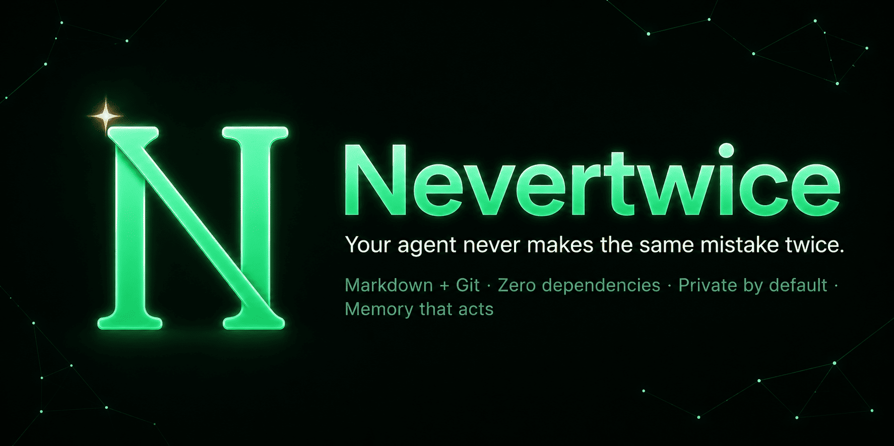
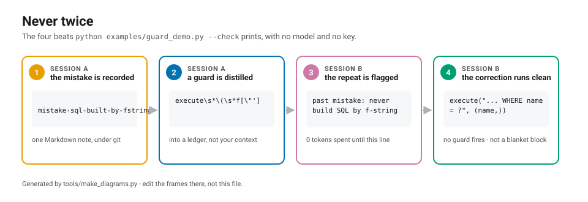

<div align="center">



# Nevertwice

### Proactive, local-first memory for AI coding agents - it acts before your agent repeats a mistake.

*Other memory tools recall text and pad every prompt with it. Nevertwice stays silent until it has
something worth saying, then fires a one-line warning at the moment your agent is about to repeat a
mistake it already made - and costs nothing until it does. The store is plain Markdown in a git
repo you own.*

**No database. No server. No account. No telemetry. Zero pip dependencies.**

[](https://github.com/DonPlaton/nevertwice/actions/workflows/ci.yml)
[](https://github.com/DonPlaton/nevertwice/actions/workflows/codeql.yml)
[](https://pypi.org/project/nevertwice/)
[](#install)
[-orange)](#privacy)
[](LICENSE)
[](#the-evidence)
[](#memory-that-acts)

```bash
pip install nevertwice          # the library, the CLI, and the MCP server
git clone https://github.com/DonPlaton/nevertwice && cd nevertwice
python install.py               # native Claude Code wiring; everything else via MCP
```

**The whole product, in four beats** - `python examples/guard_demo.py`, no model, no key, no network:



<sub>Beat 3 is the product: the lesson lives in a JSON ledger, **not** in your context, so it costs
zero tokens until the moment it fires. `--check` prints that transcript byte-identically on three
platforms and CI fails if a beat stops holding. More demos - the whole machine on one project
(**`scenario_demo.py`**), the 25-second recall demo (**`demo.py`**, any OS) - all on a throwaway
store, with a test that runs each one against an exported real vault path to prove yours is
untouched.</sub>

</div>

---

## Memory that acts

Your agent starts every session from zero: same files re-read, same gotchas rediscovered, and now
and then Tuesday's mistake repeated. Nevertwice watches each session, distils the durable lessons
into short Markdown notes, commits them to git, and feeds the relevant ones back. That much is a
better **library**, and the systems in [COMPARISON.md](docs/COMPARISON.md) all stop there -
retrieve, inject, tax every turn. We measured that axis to its end and found it
[reader-bound and commoditizing](research/QA_ACCURACY.md): the LLM, not the memory, is the variable.
So the interventions are the product, and each one is token-budgeted:

- **Guards** - a pattern distilled from a past mistake, checked against the edit before your agent writes
  it; one line fires on a match, at **zero context tokens until it does**. Measured ([GUARD_BENCH.md](research/GUARD_BENCH.md)):
  a linter wins on generic repeats; on the project-specific ones only memory knows, guards catch about two and a half times as many, at a false alarm on a fifth of **that same class's** clean calls where a linter pays none - every rate withdrawn until the post-review campaign.
  Advisory until corroborated, self-retiring on false positives, always overridable: memory proposes, reality disposes.
- **Anticipation** - predicts the failure the current plan is heading toward by resemblance to past
  ones, and surfaces *one* precise warning. Spend is proportional to risk, not paid per turn.
- **Counterfactual** - *"what breaks if I change X?"*, answered from an induced causal graph
  instead of by recalling every note that mentions the entity.

Every intervention cites the note it was born from, is overridable in one line, and is off by
default where it could be noisy. All three are on the Python API **and** the MCP server, so they
work on every agent ([INTEGRATIONS.md](docs/INTEGRATIONS.md)).

## The evidence

Small samples, run by one person - the point is that the harness is in the repo, the raw results
are committed, and [every number here resolves to one](research/evidence_manifest.json).

**Most of that corpus was withdrawn in 2026-08, and saying so is the point.** Every claim had been
stamped with the commit that last touched its *artifact file* - a directory move - rather than the
commit whose code produced the number. Once each claim was made to name the source files its
command imports, most of them turned out to describe the engine as it stood at the first release, several review rounds after
the ranker beneath them had been rewritten. Re-measuring them needs a third-party dataset this repo
does not ship, the owner's private store, or a paid API, so they are withdrawn rather than
reprinted. `python tools/check_freshness.py --list-stale` names every one and the gate that blocks
it, and CI now fails when a published number outlives the code that made it.

What survived re-measurement at HEAD, and what it cost:

| claim | result | evidence |
|---|---|---|
| external retrieval, one pool and one embedder for everyone | ahead of Mem0, LangMem and A-MEM on a hash-pinned LongMemEval corpus, whole sessions embedded on our side as on theirs - the figures are withdrawn until the campaign that follows the part-4 review re-measures them | [EXTERNAL_RETRIEVAL.md](research/EXTERNAL_RETRIEVAL.md) |
| handing back a fact that has since been **retracted** | rare between nights and rarer after the weekly consolidation, against a majority of the time for Mem0, a third for Zep/Graphiti and almost always for an append-only file with term matching. The price this row used to carry - a fact that stayed true stops being served - is now none on the explicit corpus and none with the cue removed: nothing is retired unless a rule proves the replacement or the sleep-time judge rules on it, and an unproven pair is served whole, newest first ([the causes](research/SUPERSESSION.md#what-it-costs-us)). Every rate here is withdrawn until the post-review campaign re-measures it | [SUPERSESSION.md](research/SUPERSESSION.md) |
| acting vs *always-injecting* the same lesson | same error prevention for **31×** fewer memory tokens | [ACTIVE_MEMORY.md](research/ACTIVE_MEMORY.md) |
| memory-poisoning acceptance attacks | most attacks blocked overall - every prompt injection, a quarter of plausible-false facts; the rates are withdrawn until the post-review campaign re-measures them | [POISONING.md](research/POISONING.md) |
| what being there costs | PreToolUse fell by well over a third once the hook stopped recompiling the engine on every call, and costs zero context tokens until a guard fires; the millisecond figure is withdrawn until the post-review campaign re-measures it | [BENCHMARKS.md](docs/BENCHMARKS.md) |

Every row was re-measured on 2026-09-11 on the engine as committed - the J1 evidence layer removed,
an archive-aware reconcile and a write-path literal-fact channel added (ledger J2b and the J3
addendum); the freshness contract had withdrawn every number whose closure names the engine until
that run. Earlier, a 2026-09 review found the retrieval stand had broken its own premise - our
semantic arm embedded the first two thousand characters of each session while the competitors
embedded the whole one, an error against us; the row prints the whole-session run. Competitor
arms our engine does not touch (Mem0, LangMem, A-MEM) keep their last measurement, restamped; Zep/Graphiti
was re-run twice on a flushed graph store after a defect in its arm, and its rows pool both runs. LoCoMo,
excluded on paper for a year, was run too and narrows its own exclusion rather than lifting it ([LOCOMO.md](research/LOCOMO.md)).

The 2026-07 run of that retrieval stand stays withdrawn - its corpus could not be identified -
and the re-run above is a separate claim family on a named one:

<!-- claims:head-to-head -->
> **Withdrawn 2026-08.** the LongMemEval-oracle dataset is third-party and not committed (research/data/longmemeval_oracle.json is absent here), and no content hash was recorded when the number was produced, so the run cannot be reproduced or even pinned to a revision
>
> The claim is kept in `research/evidence_manifest.json` marked `stale`, with the command that would restore it. `python tools/check_freshness.py --list-stale` prints every withdrawn number and why; `python research/head_to_head.py` is what re-measures this one.
<!-- /claims:head-to-head -->

One caveat neither run touches: the payoff scales with the agent's own capability, because memory
removes the *knowledge* bottleneck and not the reasoning one. The baseline gates a headline has to
clear and the results we deleted rather than shipped: [BENCHMARKS.md](docs/BENCHMARKS.md) ·
[BASELINES.md](research/BASELINES.md) · [WEAKNESSES.md](docs/WEAKNESSES.md) ·
[the research lab](research/).

## How it works

<p align="center"></p>

Your agent's memory is a folder of Markdown notes in a git repo, and you own every byte: open it
in Obsidian, grep it, diff it, `git pull` it to another machine, delete a note you disagree with.
Recall is hybrid - semantic over local embeddings, fused with lexical, behind a calibrated
abstention gate, so a nonsense query returns *"no confident match"* rather than a confident wrong
answer. A newer lesson that contradicts an older one retires it at write time.
Details: [ARCHITECTURE.md](docs/ARCHITECTURE.md).

## Privacy

Embeddings run locally on Ollama by default, so nothing leaves the machine;
`NEVERTWICE_EMBED_PROVIDER` points at a cloud embedder if you would rather not run a local model,
and with none at all recall falls back to lexical search rather than going dark. Extraction is
local-first and an optional cloud key only speeds it up. Secrets are redacted before anything is
written or sent. There is **no telemetry** - no account, no usage pings, no phone-home; the only
network calls are the ones you configured, and `NEVERTWICE_LOCAL_ONLY` pins projects local for good.

## Any agent

Claude Code is the zero-config case: `install.py` wires the capture, recall and guard hooks, and
capture is automatic from then on. Agents that write sessions to disk (Codex, Cline, Roo, Aider,
Gemini CLI) are covered by the `nevertwice-watch` daemon; any MCP client - Cursor, Claude Desktop,
Zed - talks to `nevertwice-mcp`. From Python, wrap your client with `auto_capture(client)` or let
the agent write its own lessons through `remember_lessons`, with no extraction model at all.
LangChain and LlamaIndex get drop-in adapters, and `nevertwice-import` moves in the memory Claude
Code, ChatGPT or Cursor already built for you. Recipes: [INTEGRATIONS.md](docs/INTEGRATIONS.md).

## Install

```bash
pip install nevertwice                 # library + nevertwice-* commands + MCP server
git clone https://github.com/DonPlaton/nevertwice && cd nevertwice
python install.py                      # idempotent; backs up ~/.claude/settings.json first
python install.py --ollama             # also pull the local models (bge-m3 + an extractor)
python install.py --profile research   # turn on the opt-in Brain layer (research/general)
python install.py --print              # dry run: shows what it would do, writes nothing
```

With no backend at all, extraction pauses loudly (sessions are kept and retried, never dropped) and
recall runs on lexical search until an embedder shows up. The five-minute walkthrough is in
[QUICKSTART.md](QUICKSTART.md); every environment variable is in [CONFIG.md](docs/CONFIG.md).

Contributing: `pip install -e ".[dev]"`, then `python -m pytest -q`. One hundred eighty-nine hermetic suites -
LLMs, embedders, the optional reranker, network and GPU execution are disabled or mocked, and a lint
fails the build if a script reaches a memory store without declaring which store it means. CI runs
them on Linux, Windows and macOS across four Python versions. One is a golden store - same sessions
in, same bytes out, with a canary proving the check can fail and [a signed list of what it misses](tests/UNPROVEN.md).

## Docs, and who wrote this

[Start here](docs/README.md) · [Quickstart](QUICKSTART.md) · [What ships today](docs/FEATURES.md) ·
[Architecture](docs/ARCHITECTURE.md) · [Integrations](docs/INTEGRATIONS.md) ·
[Configuration](docs/CONFIG.md) · [Brain layer (opt-in)](docs/BRAIN_LAYER_DESIGN.md) ·
[Benchmarks](docs/BENCHMARKS.md) · [Baseline gates](research/BASELINES.md) ·
[Comparison](docs/COMPARISON.md) · [Known weaknesses](docs/WEAKNESSES.md) ·
[Research lab](research/) · [Security](SECURITY.md) · [Threat model](docs/THREAT_MODEL.md) · [Contributing](CONTRIBUTING.md)

Built by **Platon Chernov**; formerly *Anamnesis*, renamed 2026-07 (same project, same store, the
old environment variables still work). A ⭐ is genuinely appreciated and a citation is welcome - a
`CITATION.cff` ships with the repo. MIT, see [LICENSE](LICENSE). Use it, fork it, build on it.
