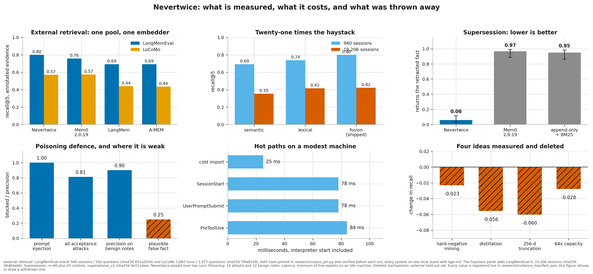

# Benchmarks & real-task evaluation

Two kinds of number here, and the difference matters:
- **External retrieval (LongMemEval-oracle):** the headline, independent ground truth.
- **Internal / real-store tasks:** self-consistency, temporal correctness, token economy
  on the owner's real bilingual (RU/EN) store (`research/eval_harness.py`, GPU-free, no key).

Almost every number below was **withdrawn in 2026-08**. Each claim used to carry the commit that
last touched its artifact *file* rather than the commit whose code produced it; once the claims
were made to name the source files their commands import, the external-retrieval corpus turned out
to describe the first release, and the internal tasks turned out to rest on a private store no
third party can rebuild. The studies, their designs and their honest caveats stay here - the
figures do not. `python tools/check_freshness.py --list-stale` lists every one and the gate that
blocks re-measuring it.

## Speed: what the hot paths cost

A memory that hooks every tool call has to be fast on modest hardware, so the costs are
measured end to end (real subprocess, stdin event to exit) with no model and no network,
the exact profile of a weak machine driving a cloud agent. Ryzen 7 7700, Windows 11,
Python 3.14; reproduce anywhere with `python research/latency_bench.py`:

<!-- claims:latency -->
| hot path | cost | when it is paid |
|---|---|---|
| PreToolUse end-to-end | **113 ms** | every tool call (interpreter start included) |
| UserPromptSubmit end-to-end | 86 ms | per prompt (task-aware recall) |
| SessionStart end-to-end, idle | 95 ms | per session start with no backlog |
| cold import of the engine | 27 ms | once per hook process (inside the numbers above) |

**Withdrawn** - `guards.check()` over a seeded ledger, lexical recall, no embedder: the bench's seed lands in the subprocess store while the in-process half reads the store pinned at import, so this row now measures an empty store (0 guards, 0 notes) instead of the seeded one the published number describes - the measurement, not just the value, is broken
<!-- /claims:latency -->

Two of these were an order of magnitude worse until a 2026-07 perf audit: an idle SessionStart
used to pay a four-second-timeout LLM liveness probe before checking whether it had any work, and
every hook process imported network machinery the guard path never uses. The before-figures are
withdrawn - they describe a tree no committed artifact records, and re-measuring them means
checking out and running the pre-audit engine. The lesson generalizes and needs no number: hooks
get measured end to end, because module-level convenience is a per-tool-call tax.

## External retrieval: LongMemEval-oracle (the headline)

Real agent sessions in one shared store, each question carrying **human-annotated** evidence
sessions (`answer_session_ids`). Relevance is **independent of our embeddings**, so this is a real
recall number rather than a self-grade - which is exactly why it is the one worth restoring first.
Reproduce:
`python research/longmem_eval.py [--xrerank]` (dataset fetched separately, see
[`research/data/README.md`](../research/data/README.md)).

<!-- claims:longmem-benchmarks -->
> **Withdrawn 2026-08.** the LongMemEval-oracle dataset is third-party and not committed (research/data/longmemeval_oracle.json is absent here), and no content hash was recorded when the number was produced, so the run cannot be reproduced or even pinned to a revision
>
> The claim is kept in `research/evidence_manifest.json` marked `stale`, with the command that would restore it. `python tools/check_freshness.py --list-stale` prints every withdrawn number and why; `python research/longmem_eval.py` is what re-measures this one.
<!-- /claims:longmem-benchmarks -->

The shipped ranker fuses the two signals with **calibrated score fusion** (z-normalise each, combine
the magnitudes), which measured above rank fusion and above the three local competitors run on the
same stand; the numbers are withdrawn with the rest of the LongMemEval corpus, and the design
argument is not (see [COMPARISON.md](COMPARISON.md)). Reciprocal rank fusion, which Nevertwice
itself shipped until 2026-07, discards the score magnitudes and scored below plain BM25; the full
study is in [`research/RETRIEVAL_FUSION.md`](../research/RETRIEVAL_FUSION.md).

The optional reranker (bge-reranker-v2-m3, `[reranker]` extra; one `NEVERTWICE_XRERANK=1` run
downloads the model, after which it stays on automatically) then stacks on top and raised top-1
recall - again on the withdrawn corpus. A *promptable* LLM reranker, by contrast, degraded top-1,
so we ship the trained one and not the LLM one. The embedder A/B (no local embedder
beat bge-m3 as a drop-in) and the consolidation negative are in
[`research/W2_PRECISION.md`](../research/W2_PRECISION.md).

## Retrieval quality (Task A: leave-one-out, self-consistency only)

> ⚠️ **What this is and isn't (read before quoting any number).** The relevance
> ground truth here is each note's own `[[wikilink]]` neighbours, which the system
> itself writes. So Task A measures **internal-linkage recovery / ranker
> self-consistency** ("does the ranker resurface a note's own siblings"), **not**
> relevance to an external information need. The table is a fair *relative* comparison
> of the three rankers on identical ground truth; the absolute R@5 is **not** an
> external quality benchmark and must not be cited as one. **For the independent number,
> see the LongMemEval-oracle section above** (external human-annotated GT). That is the
> one to cite; this self-consistency table is kept only as a relative ranker comparison.

<!-- claims:task-a -->
> **Withdrawn 2026-08.** measured on the owner's private vault, which is not committed and must never be read or written by this repository's tests - no third party can reproduce it
>
> The claim is kept in `research/evidence_manifest.json` marked `stale`, with the command that would restore it. `python tools/check_freshness.py --list-stale` prints every withdrawn number and why; `python research/eval_harness.py --save` is what re-measures this one.
<!-- /claims:task-a -->

Relative reading only: with a strong multilingual embedder, semantic leads on this
self-consistency task; lexical is the graceful fallback when the GPU is busy. (On an
earlier weaker embedder, hybrid led; the fusion is kept as a robustness floor.)

## Temporal correctness (Task B: point-in-time QA)

<!-- claims:task-b -->
> **Withdrawn 2026-08.** measured on the owner's private vault, which is not committed and must never be read or written by this repository's tests - no third party can reproduce it
>
> The claim is kept in `research/evidence_manifest.json` marked `stale`, with the command that would restore it. `python tools/check_freshness.py --list-stale` prints every withdrawn number and why; `python research/eval_harness.py --save` is what re-measures this one.
<!-- /claims:task-b -->

Flat "return all versions" surfaces several contradictory versions per query. The
bi-temporal model answers "what did we believe about X at time T" correctly where a
flat store either guesses or dumps contradictions. The measured margin is withdrawn with
the rest of the private-store corpus.

## Token economy (Task C: tokens to convey project state)

The project **card** (the SessionStart surface) vs dumping the full Context journal:

<!-- claims:task-c -->
> **Withdrawn 2026-08.** measured on the owner's private vault, which is not committed and must never be read or written by this repository's tests - no third party can reproduce it
>
> The claim is kept in `research/evidence_manifest.json` marked `stale`, with the command that would restore it. `python tools/check_freshness.py --list-stale` prints every withdrawn number and why; `python research/eval_harness.py --save` is what re-measures this one.
<!-- /claims:task-c -->

Overall the current snapshot costs materially fewer tokens than the full Context journal, and is
point-in-time and contradiction-free. The ratio itself is withdrawn.

## Token A/B: retrieval vs no-retrieval, controlled on LongMemEval

Most "agent memory saves tokens" claims are never measured against the prompts where retrieval
**misses**. We measured it. `research/token_ab.py` runs a controlled A/B on the
LongMemEval-oracle set with the counterfactual stated up front: a no-memory agent must load the
relevant history to answer; with memory it reads only the top-k and escalates to a full load on a
miss, so **net = recall@k · counterfactual − top-k cost**. The value of retrieval depends entirely
on *what it replaces*, so we reported both honest bounds - the curated small haystack and the whole
accumulated history - rather than cherry-picking the flattering one:

<!-- claims:token-ab-raw -->
> **Withdrawn 2026-08.** the LongMemEval-oracle dataset is third-party and not committed (research/data/longmemeval_oracle.json is absent here), and no content hash was recorded when the number was produced, so the run cannot be reproduced or even pinned to a revision
>
> The claim is kept in `research/evidence_manifest.json` marked `stale`, with the command that would restore it. `python tools/check_freshness.py --list-stale` prints every withdrawn number and why; `python research/token_ab.py` is what re-measures this one.
<!-- /claims:token-ab-raw -->

Read honestly, both directions:
- **Against an already-curated small context, raw-session retrieval saves nothing, often
  net-negative.** Retrieval is not magic; if the haystack is already small, just load it.
- **Against the realistic alternative at scale (the *whole* accumulated history) retrieval is
  overwhelmingly cheaper.** It is what makes recall feasible when full-load is impossible.
- This A/B models retrieval of **raw sessions**. Nevertwice's real mechanism adds a lever it omits:
  **distillation** (each session becomes a ~one-screen typed note). Measured next.

### Distillation A/B: the real mechanism, measured (the net flips positive)

Nevertwice never stores raw sessions; it stores **distilled notes**. We measured that lever directly:
distil each retrieved session into a compact note via local Ollama, then recompute the net
(`research/token_ab.py --distill`). On a question sample the distiller compressed the retrieved
sessions by more than an order of magnitude, and the per-hit cost collapsed:

<!-- claims:token-ab-distill -->
> **Withdrawn 2026-08.** the LongMemEval-oracle dataset is third-party and not committed (research/data/longmemeval_oracle.json is absent here), and no content hash was recorded when the number was produced, so the run cannot be reproduced or even pinned to a revision
>
> The claim is kept in `research/evidence_manifest.json` marked `stale`, with the command that would restore it. `python tools/check_freshness.py --list-stale` prints every withdrawn number and why; `python research/token_ab.py --distill` is what re-measures this one.
<!-- /claims:token-ab-distill -->

**This is the headline that raw-session retrieval couldn't earn:** with distillation, memory
measured **net-positive even against the already-curated small haystack**, the conservative
counterfactual. The sample was smaller and higher-variance than the full set above; the
low-variance finding was the compression ratio and the **sign flip** from negative to positive.
Both are withdrawn until the dataset ships with a hash.

### Live two-arm run: measured, not modeled

A real two-arm run (`--live`): the same small local agent answers each question twice, once
fed the full curated haystack (no memory), once fed only the top-3 **distilled notes**, recording
Ollama's own `prompt_eval_count` (actual input tokens) for each:

<!-- claims:token-ab-live -->
> **Withdrawn 2026-08.** the LongMemEval-oracle dataset is third-party and not committed (research/data/longmemeval_oracle.json is absent here), and no content hash was recorded when the number was produced, so the run cannot be reproduced or even pinned to a revision
>
> The claim is kept in `research/evidence_manifest.json` marked `stale`, with the command that would restore it. `python tools/check_freshness.py --list-stale` prints every withdrawn number and why; `python research/token_ab.py --distill --live` is what re-measures this one.
<!-- /claims:token-ab-live -->

Memory cut input tokens by a wide margin on this arm - a *measured* number, not modeled, and now
withdrawn with the rest of the LongMemEval corpus. The honest caveat survives the withdrawal
because it is a direction, not a figure: on that tiny sample with a weak 3B reader, crude
answer-match was *lower* with memory. The distilled notes sometimes drop a detail the full context
kept, so the token saving is **real but not free**. A larger sample on a stronger reader is needed
to pin the accuracy trade; we report the dip rather than hide it.

**Bottom line, with every figure withdrawn and the shape intact:** raw-session retrieval measured
net-negative against a small curated context - we published that when it was unflattering, and it is
why the distillation lever exists. Distillation flipped the sign, and a live two-arm run measured a
large input-token cut with an honest accuracy caveat on a small local-model sample. The defensible
headline is *distillation makes memory token-positive*, not "saves X tokens unconditionally", and it
will carry numbers again when the corpus is re-measured. Reproduce:
`python research/token_ab.py --distill --live`.

## Real-task battle-test: does it save tokens & help recall?

Honest accounting on a live project (`project_alpha`):

Every figure in this section was measured on the owner's private vault. None of them can be
reproduced by a reader, so all of them are withdrawn; what follows is the shape of the accounting,
which is the part a reader can check against their own store.

**Cost (what memory adds to context):**
- SessionStart injection - project card, learned profile, top relevant mistakes and patterns,
  cross-project lessons.
- Task-aware recall per *substantial* prompt (trivial prompts skipped; already-shown notes
  deduped; capped per session).

**Payoff:**
- **State conveyance is far cheaper as a representation** than reading the full Context journal to
  orient - a project card against a whole journal, on every project measured.
- **It surfaces the exact prior lesson.** For the prompt *"how to avoid CX regression
  when integrating a new QSD algorithm"*, recall returned precisely the past mistake
  `naive-swap-regression` ("naive swap in QSD caused CX/time regression; benchmark
  before integrating") plus the patterns that resolved it. Without memory the agent
  re-discovers this by re-exploring and, worst case, **repeats the failed approach**,
  an entire wasted code+test+debug iteration (thousands of tokens).

**Verdict (honest about the counterfactual).** The *measured* facts: state
conveyance is much cheaper as a representation (card vs journal), and recall
surfaced the exact prior lesson in live queries. The *unmeasured* part: whether
memory nets out cheaper **overall** depends on the counterfactual "the agent would
have re-explored the codebase." The controlled token A/B above quantifies exactly this
(net-negative vs a tiny curated context, hugely positive vs the full history); a *live*
two-arm agent run remains the one unmeasured piece. On a session where memory isn't
needed, the injection at session start and per substantial prompt is pure overhead - the
per-turn figures came off the owner's private store and are withdrawn with it;
the smart throttle (skip trivial, dedup, per-session cap) bounds it but doesn't make
it zero. So: clearly positive when it prevents a repeated mistake or a re-exploration;
a small bounded overhead otherwise. Treat the token math as a favourable side-effect,
**not** a proven net saving, and not the headline.
