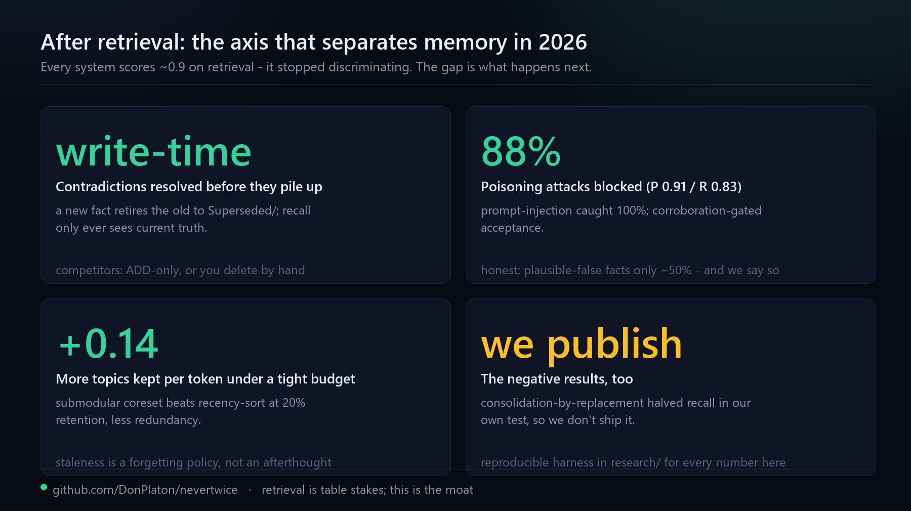

# What ships today

Everything on this page exists in the repository now. Planned work lives in
[ROADMAP.md](../ROADMAP.md), and every measured claim links to the study that produced it
rather than restating a number here.

## The store, and reading it

Your agent's memory is a folder of Markdown notes in a git repo. You own every byte: open it in
Obsidian, grep it, diff it, `git pull` it to another machine, delete a note you disagree with.
Sync between machines is `git pull`; concurrent edits to the same note auto-merge field by field
(recurrence takes the max, a retirement wins, tags union).

Two read-only commands surface the store for a human or an agent, with no embedder, no LLM and no
network:

```bash
python -m nevertwice.digest --days 7      # what was added / revised this week, per project & type
python -m nevertwice.digest --conflicts   # the supersession ledger: every fact the memory revised
```

`digest` is the daily or weekly "what's new". `--conflicts` is the audit trail behind
*"contradictions don't pile up"*, pairing each retired note with the one that superseded it. Both
are also `nevertwice.api.digest()` / `nevertwice.api.conflicts()` and MCP tools (`memory_digest`,
`memory_conflicts`), so an agent can ask too.

When something feels wrong, one command says what and how to fix it:

```bash
nevertwice-doctor            # a readable report
nevertwice-doctor --json     # the same thing, schema-stable, for a script or an agent
nevertwice-doctor --probe    # additionally reach the extractor and the embedder
```

It checks the store is writable and stamped, whether the hooks are wired, whether capture has
gone quiet, which extraction backend would run, whether the embedding cache was built by the
model you are querying with, whether the index and the background sweep are current, whether
the graph generator still imports, and whether the package running is the one you think. Every
warning carries a repair you could run - printed, never executed, because a diagnostic that
edits your store is not one. Only the `--probe` mode touches the network.

Prefer a visual? One command writes a **single self-contained HTML file** - no server, no account,
no external asset - that you open in a browser:

```bash
python -m nevertwice.dashboard --days 30      # writes memory_dashboard.html, then opens it
```

It is a snapshot of the whole store (stats, per project, recent notes, the contradiction ledger,
top entities) that you can mail, commit, or read offline. The file *is* the UI, the same way the
notes *are* the database. For live editing, the vault opens in Obsidian as-is.

## Recall and correctness

<p align="center"></p>

- **Bi-temporal queries.** Ask *"what did we believe on March 3?"* and the answer comes from that
  day's truth, not today's.
- **Supersession at write time.** A new fact that contradicts an old one retires it immediately;
  the old note moves to `Superseded/`, kept for history but out of the recall pool, so recall never
  serves both. A fix links back to the bug it resolved.
- **Multi-hop and abstention.** Recall walks `[[wikilinks]]` for multi-hop answers, carries lessons
  across projects, and returns *"no confident match"* rather than guessing.
- **Secrets are redacted** before anything is written or sent, and a poisoning guard rejects
  injection, exfiltration and destruction attempts - measured, including where it does worse, in
  [research/POISONING.md](../research/POISONING.md).
- **Bounded growth.** A SQLite index keeps per-query cost flat into tens of thousands of notes, and
  a submodular forgetting cap stops the store growing without limit
  ([research/FORGETTING.md](../research/FORGETTING.md)).

## Portability

The per-project card travels: it exports to `AGENTS.md` and to the Open Knowledge Format (OKF, the
draft Google/Anthropic interchange spec), so other tools can read what yours knows.

Memory your other tools already built moves in with one command - Claude Code auto-memory, a pasted
ChatGPT export, `.cursor/rules`, or bullets from any `AGENTS.md`. Imports go through the same write
path as everything else (redaction, injection rejection, recallable at once even with no model) and
re-running is safe: a content ledger skips what is already in. Commands and per-agent recipes are in
[INTEGRATIONS.md](INTEGRATIONS.md).

To seed a rich context card for a large existing project right away, instead of waiting for
sessions to accumulate, point the bootstrapper at it:

```bash
python -m nevertwice.bootstrap_contexts /path/to/project
```

## The opt-in Brain layer

The same captured sessions can self-wire into a knowledge graph for research or personal knowledge:
typed entities (paper, method, dataset, benchmark, …), per-entity cards that roll up everything
known about each across projects, a timeline of how your take on it evolved, and a graph-centrality
salience signal.

It is **pull-only** - read on demand, never injected - so the lean, token-bounded hot path is
byte-for-byte unchanged when it is off, which is the default. Turn it on with
`NEVERTWICE_PROFILE=research` (or `general`); the design note is
[BRAIN_LAYER_DESIGN.md](BRAIN_LAYER_DESIGN.md).

## What we measured and cut

Most memory projects pile on clever ranking and assume it helps. We built the clever parts,
measured them on real data, and deleted the ones that lost, because a memory you cannot trust is
worse than none: a promptable LLM reranker lowered top-1 precision against the plain bi-encoder, no
"stronger" local embedder beat bge-m3 at top-1, and abstractive consolidation - summarising many
notes into one principle - dropped real recall, because a general principle embeds away from the
specific question that needs it. The recurrence prior is a sound mechanism that stays dormant on a
young single-user store, so it sits off the hot path. The one idea that earned its place was the
trained cross-encoder, and we only learned which was which by measuring.

The numbers behind each of those, and the baseline any headline has to clear before it may be
published, are in [BENCHMARKS.md](BENCHMARKS.md), [research/BASELINES.md](../research/BASELINES.md)
and [the research lab](../research/). Known limits are in [WEAKNESSES.md](WEAKNESSES.md).
