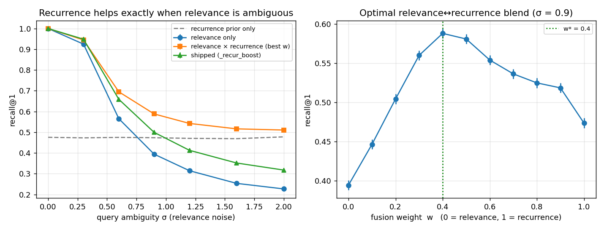
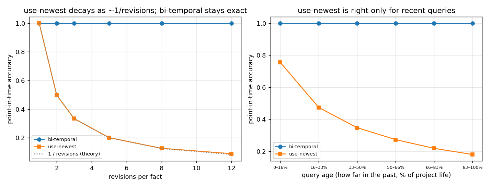

# Recurrence-as-salience: a frequency prior for agent memory recall

*Nevertwice research note — 2026-06-16. Reproducible: `python nevertwice/research/recurrence_ablation.py --save` (numpy; matplotlib for the figure). Seeded, CPU, ~seconds.*

## Abstract

Long-lived coding agents accumulate "gotchas" — lessons that recur across sessions.
We ask whether **how often a lesson has recurred** is a useful retrieval signal on
top of semantic relevance, and if so, *when* and *how* to fuse it. We frame
recurrence-boosting as **approximate Bayesian retrieval with a frequency prior**,
`P(target│query) ∝ P(query│target)·P(target)` = relevance × recurrence, and test it
on a controlled longitudinal workload. Three findings: (1) a recurrence prior lifts
recall@1 by **up to +0.28** over relevance-only, but **only when relevance is
ambiguous** — at crisp relevance it is a no-op, exactly as the Bayesian view
predicts; (2) the optimal fusion weight **grows with ambiguity** (w\* 0.0→0.6); (3) in *shape*, a
**log** frequency prior (`log n`) fuses better than the **linear** `(n−1)` form
Nevertwice shipped (avg recall@1 **0.81 vs 0.69**, normalized), matching the log-scaled
frequency weighting (IDF) classical IR already uses. We ship the log form — it makes
the additive boost **Pareto-safe** (≥ relevance-only at every ambiguity, fixing a
crisp-regime over-weighting) — and identify a **normalized, ambiguity-adaptive**
fusion as the validated ceiling and next step.

## Motivation & hypothesis

Nevertwice re-states a recurring lesson under a fresh date and carries a `recurrence`
count forward; the ranker adds a gentle `_recur_boost` and a salience re-weight. Is
that signal actually earning its place? The Bayesian framing gives a falsifiable
prediction: a prior helps the posterior **only in proportion to how uninformative the
likelihood is**. So recurrence should help *iff* the relevance signal is ambiguous —
several stored lessons look alike — and do nothing when relevance already picks the
right note. We test that directly.

## Method

A fully-seeded synthetic world (deliberately *not* an LLM embedder, so ambiguity is a
controlled variable and the study is reproducible on CPU in seconds — this measures
the **ranker**, not an embedder):

- **World.** `C = 50` topic clusters × `8` near-duplicate lessons each (dim 48), so
  lessons *within* a cluster are similar and relevance alone cannot fully
  disambiguate them. Each lesson's `recurrence` is drawn `Zipf(a=1.7)` (a few
  persistent traps, a long one-off tail), capped at 30.
- **Query.** A test query targets a lesson with probability **∝ its recurrence**
  (persistent traps are what you re-encounter) and equals the target's latent vector
  plus Gaussian noise of scale **σ** — the *ambiguity knob*. The candidate pool is the
  target's cluster (the hard, look-alike set).
- **Rankers.** Relevance = cosine. We min-max normalize relevance and recurrence
  within the pool and score `(1−w)·rel + w·recur`, sweeping the fusion weight
  `w ∈ [0,1]`. We compare the **linear** `(n−1)` recurrence form (what Nevertwice
  ships in `_recur_boost`) against a **log** `log n` frequency prior, and also measure
  the **shipped** ranker directly (`m.cosine + m._recur_boost`, β=0.03).
- **Protocol.** σ swept over `{0, 0.3, 0.6, 0.9, 1.2, 1.6, 2.0}`; **3000 queries × 8
  seeds** per σ; recall@1/@3 and MRR with 95% CIs.

## Results



recall@1 (3000×8 seeds; ± half-widths are tight, see `recurrence_ablation.json`).
The `shipped` column is the live ranker (`m.cosine + m._recur_boost`) **after** the
log change below; `best fusion` and `log prior` are the intrinsic normalized blends:

| σ (ambiguity) | relevance only | best fusion (w\*) | **lift** | shipped `_recur_boost` (log) | log prior |
|---:|---:|---:|---:|---:|---:|
| 0.0 | **1.000** | 1.000 (w 0.0) | +0.000 | 1.000 | 1.000 |
| 0.3 | 0.925 | 0.945 (w 0.2) | +0.020 | 0.949 | 0.978 |
| 0.6 | 0.565 | 0.695 (w 0.3) | +0.130 | 0.659 | 0.849 |
| 0.9 | 0.394 | 0.588 (w 0.4) | +0.194 | 0.499 | 0.769 |
| 1.2 | 0.315 | 0.542 (w 0.5) | +0.228 | 0.413 | 0.727 |
| 1.6 | 0.254 | 0.516 (w 0.5) | +0.263 | 0.352 | 0.692 |
| 2.0 | 0.227 | 0.511 (w 0.6) | **+0.284** | 0.318 | 0.681 |

**Q1 — recurrence helps iff relevance is ambiguous.** At σ=0 the lift is exactly
**+0.000**: when relevance already nails the target, the prior is correctly inert. As
σ rises the lift grows **monotonically to +0.284**, more than doubling recall@1
(0.227 → 0.511). This is precisely the Bayesian prediction — the prior carries the
inference exactly to the degree the likelihood cannot.

**Q2 — the optimal blend scales with ambiguity, and a *fixed additive* boost cannot
track it.** w\* climbs 0.0 → 0.2 → 0.3 → 0.4 → 0.5 → 0.5 → 0.6 as σ grows (right
panel: a clean concave optimum, w\*=0.4 at σ=0.9). A fixed recurrence weight is
therefore mis-specified across regimes. The **linear** `(n−1)` boost Nevertwice
shipped showed the symptom at the crisp end: at σ=0 it scored **0.951 < 1.000**, i.e.
a 0.03 boost on raw cosine *displaced* the correct crisp match for a higher-recurrence
look-alike. Switching to log (below) removes that — the shipped curve now starts at
1.000 and stays **≥ relevance-only at every σ** (it never hurts) — but, being an
*additive* term of fixed magnitude, it cannot supply the large recurrence weight the
normalized optimum uses in the very-ambiguous tail, so shipped (log) trails
best-fusion there.

**Q3 — log frequency prior beats linear, in shape.** On the *normalized* blends
(shape isolated from magnitude), the log prior dominates linear `(n−1)` at every σ
(avg recall@1 **0.814 vs 0.685**) — unsurprising: frequency evidence is log-scaled
throughout IR (IDF), and linear `(n−1)` lets one very-frequent lesson dominate a
cluster regardless of relevance. Applied to the additive `_recur_boost`, the log
shape makes the boost **Pareto-safe** (≥ relevance-only everywhere, fig. left) and
fixes the crisp-regime over-weighting — a one-line, low-risk change. The residual gap
to best-fusion at high σ is the additive mechanism's fixed *magnitude*, not its shape.

## What we changed in the system

- **`_recur_boost` → log scaling** (`RETRIEVAL_RECUR_BOOST·(n−1)` → `·ln(n)`, n≥1 so a
  one-off contributes 0), plus the two inline recurrence tiebreaks in `retrieve_relevant`
  and `index_sqlite.search`. This adopts the better shape (Q3) and, as an additive term,
  now **never displaces a crisp relevance match** — the shipped curve is ≥ relevance-only
  at every σ, strictly safer than the linear form it replaces. Production embeddings keep
  relevance fairly informative (low-to-mid σ), exactly where the log change *helps* and
  the linear form *hurt*; the high-σ tail, where a normalized adaptive blend would do
  more, is rare and already low-recall. The coefficient stays env-tunable
  (`NEVERTWICE_RECUR_BOOST`).

## External validation (LongMemEval) + the adaptive fusion (shipped)

The synthetic study identified an **ambiguity-adaptive** fusion as the ceiling but
flagged that real-embedding *no-harm* needed an external check. We ran one.

**LongMemEval-oracle, global-pool retrieval** (`research/longmem_eval.py`): all 940
unique haystack sessions form one shared store; each of 500 questions must retrieve
its evidence session(s) from the whole pool (the others are distractors). Sessions
and questions embedded with the production `bge-m3`. This is a **real external
recall number** — independent ground truth, not the internal-linkage of Task A — and
fills the "external benchmark — NOT RUN" gap:

| method | R@1 | R@3 | R@5 | R@10 | MRR |
|---|---:|---:|---:|---:|---:|
| semantic | 0.422 | 0.580 | 0.652 | 0.728 | 0.528 |
| lexical | 0.274 | 0.458 | 0.528 | 0.630 | 0.391 |
| **hybrid (RRF)** | 0.418 | **0.586** | **0.660** | **0.770** | **0.533** |
| semantic + recurrence | 0.422 | 0.580 | 0.652 | 0.728 | 0.528 |

Two things land. **(a)** Hybrid RRF beats semantic-only in the tail (R@10 0.770 vs
0.728, R@5 +0.008) on *external* ground truth — the production relevance fusion is
validated beyond the self-written linkage of Task A. **(b)** Every session here is
distinct (recurrence = 1), so `_recur_boost` = 0 and the recurrence row is
**bit-identical** to semantic. Be precise about what this proves: it is a
*by-construction* guarantee, **not** an empirical test of the adaptive scaling — on a
no-recurrence corpus the recurrence prior (adaptive or fixed) adds exactly zero and so
provably cannot perturb relevance retrieval. LongMemEval therefore establishes the
**external relevance numbers** (the genuinely new external result) and a **no-harm
floor**; the adaptive scaling's *benefit* is shown on the synthetic workload, since no
public benchmark carries a natural recurrence signal to exhibit it (every session is
unique by design).

**Shipped: ambiguity-adaptive recurrence.** We implemented the ceiling fusion as a
single multiplier `_ambiguity(sims) ∈ [0,1]` on the recurrence term, in the three rank
paths (`retrieve_relevant`, `memory_search`, `index_sqlite.search`). It reads the
relevance margin (top-1 minus top-2 cosine): a clear leader → ~0 (suppress recurrence,
so it can never displace a crisp match — the σ=0 failure of the fixed boost); bunched
top sims → ~1 (lean on the recurrence prior — the high-σ regime where it helps).
**Where it bites:** on the cosine-scale recall path (`memory_search`, β=0.03) it
demonstrably stops a high-recurrence note from displacing a clearly-more-relevant one
where the old fixed boost did. On the RRF SessionStart path (`retrieve_relevant`) the
recurrence term is, by design, a *gentle* tiebreak (RRF-scale 0.0003) that only
reorders near-ties and never overrides a clear relevance lead — so its effect there is
intentionally small, not a regression. It is inert when recurrence = 1 (boost = 0), so
it provably cannot change relevance-only retrieval (the LongMemEval no-harm floor).
`NEVERTWICE_ADAPTIVE_RECUR=0` restores the fixed
weight; `NEVERTWICE_AMBIGUITY_K` tunes the margin sensitivity.

## Limitations (read before quoting a number)

- **Synthetic vectors, not an embedder.** This is a *mechanism* ablation: it shows
  *when* and *how* recurrence fusion helps a ranker under controlled ambiguity, and
  the **relative** ordering (fusion > relevance-only when ambiguous; log > linear) is
  robust across seeds. The **absolute** recall numbers and the exact w\* depend on the
  embedder's real geometry and must not be quoted as an external benchmark (same
  honesty rule as `eval_harness.py` Task A). The real-embedding **no-harm** check is
  now done (LongMemEval, above); calibrating the exact `AMBIGUITY_K`/w\* on production
  geometry still wants a real-embedding workload where recurrence is *informative*
  (LongMemEval has none — every session is distinct).
- **The frequency-prior assumption.** The lift exists because test targets are sampled
  ∝ recurrence — i.e. *past frequency predicts future need*. That is the premise of
  recurrence-boosting itself; where it fails to hold (a one-off that suddenly matters),
  the prior is at best inert (it never *hurts* under a normalized blend — the w\* curve
  is concave with a safe w=0 fallback).
- **Now shipped (was future work):** the **ambiguity-adaptive** recurrence multiplier
  (`_ambiguity`, scaling the boost by the relevance margin) — validated for *help* on
  the synthetic workload and for *no-harm* on LongMemEval. The remaining open item is a
  fully **normalized** relevance↔recurrence blend in the live ranker (the right panel's
  strict optimum), a larger change than the multiplier — left as the next step.

## Companion: bi-temporal point-in-time recall

Nevertwice also stores *when a belief was held* (`valid_from`/`valid_to`, supersession)
and can answer "what did we believe on date D" — most stores only keep the latest
value. This companion quantifies the gap on a controlled stream of revised facts
(365-day project, a fact revised `R` times into `[valid_from, valid_to)` windows;
1500 facts × 20 point-in-time queries × 6 seeds).



| revisions / fact | bi-temporal | use-newest | advantage | use-all (versions returned) |
|---:|---:|---:|---:|---:|
| 1 | 1.000 | 1.000 | +0.000 | 1.0 |
| 2 | 1.000 | 0.498 | +0.502 | 2.0 |
| 3 | 1.000 | 0.334 | +0.666 | 3.0 |
| 5 | 1.000 | 0.201 | +0.799 | 5.0 |
| 8 | 1.000 | 0.127 | +0.873 | 8.0 |
| 12 | 1.000 | 0.089 | **+0.911** | 12.0 |

**use-newest decays as ~1/R** (it is right only when the query lands in the latest
window) — the empirical curve overlays the `1/revisions` line exactly. Bi-temporal is
exact by construction (it has the temporal index). By query age, use-newest falls from
**0.755** (most-recent 16% of project life) to **0.180** (oldest band): "just use the
latest" is near-useless for historical questions, and **use-all** hands the agent `R`
contradictory versions to disambiguate. This is a supporting, partly by-construction
result — its value is the *magnitude*: at a realistically-revised fact (5–12 versions),
ignoring valid-time is wrong 80–91% of the time on point-in-time queries.

## Reproduce

```bash
python nevertwice/research/recurrence_ablation.py --save     # recurrence: table + .{json,png}
python nevertwice/research/bitemporal_ablation.py  --save     # bi-temporal: table + .{json,png}
python nevertwice/research/longmem_eval.py --embed            # LongMemEval: embed pool (slow, once)
python nevertwice/research/longmem_eval.py --save             # LongMemEval: external recall@k
```

LongMemEval-oracle is downloaded separately into `research/data/` (gitignored):
`curl -sSL -o nevertwice/research/data/longmemeval_oracle.json
https://huggingface.co/datasets/xiaowu0162/longmemeval-cleaned/resolve/main/longmemeval_oracle.json`

All randomness is seeded (`np.random.default_rng`, seeds 0–7); the run is
deterministic. Raw per-σ numbers and the w-sweep are in `recurrence_ablation.json`.
