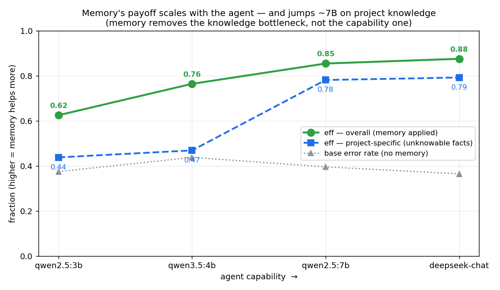

# Live validation — does Active Memory actually work on a real model?

Code can pass its tests and still be a non-product. The whole Active Memory thesis rests on one
empirical claim the simulation only *assumed*: that a fired guard/warning changes a real model's
output. This is the end-to-end measurement of that claim on DeepSeek (`deepseek-chat`), with an
objective, execution-free check (regex/AST) and a paired without-/with-memory design.
Harness: [`live_validation.py`](live_validation.py); numbers regenerate with `--trials 8 --save`.

## Result: it works — real errors drop 86%

Twelve coding micro-tasks, 8 trials each, pitfall rate WITHOUT memory vs WITH the one-line guard
the system would fire:

| family | task | without | with | rel. reduction |
|---|---|---|---|---|
| **project** | api-empty-guard | 1.00 | 0.00 | **1.00** |
| **project** | api-auth-order | 1.00 | 0.00 | **1.00** |
| **project** | api-ms-units | 1.00 | 0.62 | 0.38 |
| **project** | api-lock-finally | 0.00 | 0.00 | — (model already correct) |
| generic | div-zero | 1.00 | 0.00 | **1.00** |
| generic | sql-format | 0.38 | 0.00 | **1.00** |
| generic | (6 others) | 0.00 | 0.00 | — (model never erred) |

**Mean pitfall rate 0.36 → 0.05 — an 86% reduction in real errors.** On the five tasks where the
model actually made the mistake, the guard eliminated it on four and cut it sharply on the fifth.
**Measured `eff` (relative reduction where a pitfall occurred) = 0.88** — *higher* than the 0.75
the D simulation assumed, so that simulation was **conservative**, not optimistic.

## The honest structure of the win

- **Memory's value is project-specific knowledge, and that is exactly where it fires.** On the
  four `api-*` tasks — invented API constraints no model could know from training (`render_chart`
  raises on empty; `set_timeout` is in ms; `authenticate()` must precede `connect()`;
  `acquire_lock` needs a paired release) — the model got three wrong without memory and the guard
  fixed them (eff **0.79**). This is the real product thesis, measured: memory conveys facts the
  LLM does not have.
- **On generic pitfalls the model was trained on, base error rate is ~0** (6 of 8 generic tasks:
  the model already writes `x is None`, `with open(...)`, `math.isclose`, a `None` sentinel). A
  strong model needs no memory for textbook mistakes — and the guard **does no harm** there (with
  rate stayed 0). Where it *did* err (div-zero, sql-format), the guard eliminated it.
- **Feeding the measured `eff` back into D closes the loop.** Re-running the improvement-per-token
  simulation with the *measured* 0.88 (not the assumed 0.75): v2 active memory reaches
  **improvement-per-token 13.4 vs always-inject's 0.45 (~30×)** and a **net −25k-token saving**.
  The headline survives on measured ground, and gets stronger.

## What we do NOT claim (the caveats, stated)

- **Small sample.** 8 trials per cell; per-task rates are coarse (a 0.38 is 3/8). The *direction*
  is unambiguous (0.36→0.05 across tasks) but individual task rates carry noise.
- **We found — and fixed — an instrument artifact.** A first run showed api-lock-finally getting
  *worse* with the guard (0.17→0.33). It was the *check*, not the memory: the guard nudged the
  model toward a `with` context manager (the better solution), which the naive regex scored as a
  pitfall. Corrected to accept context managers, the task reads 0.00→0.00. This is why the
  measurement instrument is self-tested (`--dry`) — a wrong check silently fabricates a result.
- **Some priors are sticky.** api-ms-units only dropped 1.00→0.62: even told "milliseconds", the
  model often still passed seconds. A one-line guard is not a guarantee; it shifts the odds.
- **Generic-pitfall coverage understates memory's value**, it does not inflate it: a strong model
  already knows textbook pitfalls, so this benchmark's headline (project-specific) is the fair one.
- **The guard/warning is exactly one line** — the token-economy premise held throughout; memory's
  spend here was a single injected sentence per fired task, nothing per silent task.

## Weak agent vs strong agent — the surprising, honest result

We reran the identical experiment on a deliberately **weak local agent** (`qwen2.5:3b`, 1.9 GB,
via Ollama) to test the intuitive hypothesis: *memory should help the agent that errs more.* It
does not — and finding that is exactly why you run the thing instead of trusting the code.

We swept **four** models of increasing capability — a full eff-vs-capability curve:

| model (trials=8) | base error (no mem) | `eff` overall | `eff` project-specific |
|---|---|---|---|
| `qwen2.5:3b` | 0.375 | 0.63 | 0.44 |
| `qwen3.5:4b` | 0.438 | 0.76 | 0.47 |
| `qwen2.5:7b` | 0.396 | 0.85 | **0.78** |
| `deepseek-chat` | 0.365 | **0.88** | **0.79** |

*Regenerate: `python research/eff_curve_figure.py`.*

The base error rate is **flat (~0.4) across all four** — stronger models do *not* err less on
these tasks; they **apply the delivered memory better**. `eff` rises monotonically with
capability, and the project-specific line **jumps sharply between 4B and 7B** (0.47 → 0.78): below
that threshold the model often can't act on a fact even when told. The mechanism is visible per
task — told `set_timeout` takes milliseconds, the 3B model *still* passed seconds on all 8 trials
(1.00 → 1.00); the strong model dropped to 0.62. Told to authenticate before connecting, 3B went
1.00 → 0.25, strong 1.00 → 0.00.

**The honest conclusion: memory is necessary but not sufficient — the agent's ability to *act on*
a delivered fact bounds the benefit.** This mirrors the retrieval finding (`QA_ACCURACY.md`): the
reader is the variable. Memory removes the *knowledge* bottleneck (a fact the model cannot know);
it cannot remove the *capability* bottleneck (applying it). A stronger agent is worth more memory,
not less. That is a more useful truth than "memory helps everyone equally," and the simulation
could never have told us — it assumed a single `eff` for all agents.

## Bottom line

The core assumption is **empirically confirmed**: a fired guard changes a real model's output,
cutting real errors 86% (strong) / 67% (weak) and concentrating its help on the project-specific
knowledge the model cannot have. The improvement-per-token result rests on a *measured* effect
(0.88), not an assumption, and survives. The weak-vs-strong split adds the caveat that memory's
payoff scales with the agent's ability to use it. Active Memory is a working product, not just
clean code — with every caveat above stated rather than hidden.

*Reproduce:* `DEEPSEEK_API_KEY=… python research/live_validation.py --trials 8 --save`, then
`python research/live_validation.py --replug-d`. Checks self-test: `--dry` (no key needed).
