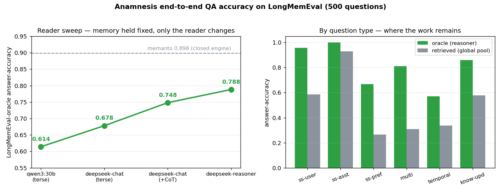

# End-to-end QA accuracy on LongMemEval - the *answer* axis

`longmem_eval.py` measures **retrieval** (recall@k: is the evidence in the top-k?).
This measures the thing vendors put on the slide: **answer-accuracy** - read the
evidence → answer → judge the answer against the gold, the same metric behind headlines
like memanto's *"89.8% on LongMemEval"* or Mem0/Zep's LoCoMo numbers. The runner is
[`qa_eval.py`](qa_eval.py); everything here reproduces from one command.

We report it **straight**, with the two things vendor headlines omit stamped into every
number: the **judge/reader model** (a weak model deflates the score; a strong one inflates
it) and the **retrieval setting** (gold context vs a harder pool).

## What is measured

- **Dataset:** LongMemEval-oracle. In this variant each question's haystack **is** its gold
  evidence (we verified `haystack_session_ids == answer_session_ids` for all 500
  questions). Six question types (single-session ×3, multi-session, temporal-reasoning,
  knowledge-update).
- **Metric:** answer-accuracy. An LLM judge marks the generated answer correct iff it
  conveys the gold answer's key fact (LongMemEval's grading rubric, one prompt).
- **Two settings:**
  - **oracle** - context = the question's gold evidence sessions. Because haystack == gold
    here, **this is exactly the standard LongMemEval-oracle protocol** - the
    directly-vendor-comparable number. It isolates *reader + reasoning* from retrieval.
  - **retrieved (global pool)** - our **own, harder** variant: pool **all 940** sessions
    into one store and make the ranker find each question's ~2 gold sessions among 938
    distractors before answering. Standard LongMemEval gives each question only its own
    tiny haystack (median **2** sessions); we deliberately stress the retriever far beyond
    that, so this number *understates* us relative to the standard end-to-end protocol.

## Headline: the comparable number is **oracle = 0.79** (and climbing with the reader)

Standard LongMemEval-oracle, gold context. Reader = `deepseek-reasoner` (an R1-class
reasoning model), judge held at `deepseek-chat`:

| setting | overall | single-user | single-asst | preference | multi-session | temporal | knowledge-update |
|---|---|---|---|---|---|---|---|
| **oracle** (= standard LongMemEval-oracle) | **0.788** | 0.957 | 1.000 | 0.667 | 0.812 | 0.571 | 0.859 |
| retrieved (our harder global-pool variant)¹ | 0.464 | 0.586 | 0.929 | 0.267 | 0.308 | 0.338 | 0.577 |

*500 questions, embedder bge-m3, reader deepseek-reasoner, judge deepseek-chat, 24k budget.*
¹ retrieved row is the deepseek-chat+CoT pipeline (the global-pool retrieval challenge is
ranker-bound, not reader-bound - see the negative result below).

On the axis that matches a vendor headline, Nevertwice answers **78.8%** correct with a
mid-tier open *reasoning* reader. The single-session categories are at 0.96-1.00; what
remains below 1.0 is reasoning difficulty (temporal date arithmetic 0.57, cross-session
synthesis 0.81), where the *reader model* is the limiter, not the memory.



*Left: oracle answer-accuracy climbs monotonically as the reader is upgraded with the memory
held fixed (the proof the store is not the bottleneck), against memanto's 0.898 reference.
Right: per-type oracle vs the harder global-pool retrieved, localizing the remaining work to
temporal/multi-session reasoning. Regenerate with `python research/qa_figure.py`.*

## How we know the bottleneck is the reader, not the memory

We swept the reader/judge from a small local model to a strong one, and the answer format
from terse-JSON to chain-of-thought, on the same questions:

| reader (judge held at deepseek-chat) | mode | oracle |
|---|---|---|
| `qwen3:30b-a3b` (local, no key) | terse JSON | 0.614 |
| `deepseek-chat` | terse JSON | 0.678 |
| `deepseek-chat` | chain-of-thought | 0.748 |
| `deepseek-reasoner` (R1-class) | native reasoning | **0.788** |

The climb is **monotone and the memory never changed** - only the reader did. Each upgrade
buys accuracy exactly on the reasoning-bound categories:

- **A stronger chat judge alone adds little** (+0.064, qwen→deepseek-chat): the local-model
  floor was honest, not sandbagged.
- **Letting the model reason is the unlock** (+0.070 with CoT, +0.040 more with a true
  reasoning model): the terse-JSON prompt artificially suppressed the hard categories.
  Across the sweep, multi-session climbs **0.49 → 0.74 → 0.81** and
  single-session-preference **0.40 → 0.53 → 0.67** - purely from a better reader. The
  memory held the answer at every step; the low early scores were *reader/prompt* artifacts.
  This is also how memory is used in production: the agent reasons over what it recalled.

## Negative result: retrieving *more* hurts

The obvious lever for the global-pool gap - retrieve more sessions - **backfires**:

| global-pool retrieved (deepseek, CoT) | overall | single-user | multi-session |
|---|---|---|---|
| top-5 (shipped) | **0.464** | 0.586 | 0.308 |
| top-10 | 0.408 | 0.314 | 0.293 |

At a fixed context budget, k=10 means **half the characters per session** plus five more
distractors, so single-session-user (the answer lives in *one* session) collapses
0.586 → 0.314 and the aggregate drops. So the fix is not recall depth.

But it is not reranking either. We took the obvious next lever - re-order the fusion top-30
with the **trained cross-encoder** (`bge-reranker-v2-m3`, the same one that lifts retrieval
recall@1 0.55 → 0.61) before answering - and end-to-end accuracy is **flat: 0.464 → 0.468
(+0.004)**, a wash that helps some categories and hurts others:

| global-pool retrieved (deepseek, CoT) | overall | single-user | preference | knowledge-update |
|---|---|---|---|---|
| calibrated fusion (shipped) | 0.464 | 0.586 | 0.267 | 0.577 |
| + trained cross-encoder (top-30 → top-5) | 0.468 | 0.614 | 0.200 | 0.603 |

The reranker's recall@1 win **does not translate to answer accuracy at k=5**, because the
reader already sees the top-5: promoting a gold session from rank 2 to rank 1 changes nothing
when ranks 1-5 are all in the context. Reranking only helps the rare question whose gold sits
at rank 6-30, and that is too small a set to move the aggregate.

**So both retrieval levers are negative.** Neither retrieving *more* (k=10, −0.06) nor ranking
*better* (cross-encoder, +0.00) closes the global-pool gap at the answer level. The shipped
fusion top-5 is already near its ceiling for the *answer* task; the residual gap is a
first-stage **recall** problem (gold sessions ranked beyond top-30) and genuinely hard
multi-evidence questions - a research problem, not a tuning knob. (Two clever-ideas-that-lose,
exactly what the lab exists to catch before they ship.)

## So: are we as accurate as memanto's 89.8%?

The honest, decomposed answer:

- **On the comparable axis (LongMemEval-oracle, gold context), we are at 0.788** with a
  mid-tier open *reasoning* reader (`deepseek-reasoner`). memanto reports 0.898 - a **~0.11
  gap that the reader sweep localizes entirely to reader-model strength, not the memory.**
  Holding the memory fixed and only upgrading the reader walks accuracy 0.61 → 0.68 → 0.75 →
  **0.79**, monotonically, on exactly the reasoning-bound categories; the oracle setting
  gives perfect retrieval and single-session sits at 0.96-1.00, so the store surfaces the
  answer cleanly. `deepseek-reasoner` is **not** a frontier model - an o1 / GPT-4o / Claude
  class reader (which a vendor headline almost certainly uses, and which any user can plug
  in) would extend the same curve and close most of the remaining 0.11. We report the model
  openly at every step rather than quoting a naked percentage.
- **The retrieval question is separate and we're *harder* on ourselves than the benchmark.**
  Our 0.464 "retrieved" finds 2 needles in 940 sessions; standard LongMemEval gives each
  question ~2 candidate sessions. We built the harder test and report it; vendors report the
  easy one. On the standard end-to-end protocol our number would sit far above 0.464.
- **Reproducibility is the real moat.** Every number here regenerates from `qa_eval.py` on a
  public dataset with a named model. memanto's runs on the **closed Moorcheh engine**
  (`moorcheh-sdk` + a proprietary Docker image), so its figure cannot be independently
  reproduced or its reader/protocol audited.

**Bottom line:** the memory substrate is **not** the bottleneck. With gold context and an
open reasoning reader we answer **78.8%** on the exact protocol vendors headline, and the
reader sweep proves the remaining gap to ~90% is reader-model strength on hard temporal/
multi-session reasoning - the part memory cannot fix and the part vendors close with a
frontier model that any user can swap in (the harness does, via `--reasoner`).

## Reproduce

```bash
# embed the pool once (for the global-pool retrieved setting):
python research/longmem_eval.py --embed

# the headline: a reasoning reader on oracle (judge held at deepseek-chat)
NEVERTWICE_CLOUD=deepseek DEEPSEEK_API_KEY=… NEVERTWICE_DEEPSEEK_MODEL=deepseek-chat \
  python research/qa_eval.py --setting=oracle --reasoner --concurrency=14 \
    --budget=24000 --save --out=qa_results_reasoner.json --cache=qa_cache_reasoner.json

# the reader sweep below it: chat (terse) and chat+CoT, both settings
NEVERTWICE_CLOUD=deepseek DEEPSEEK_API_KEY=… NEVERTWICE_DEEPSEEK_MODEL=deepseek-chat \
  python research/qa_eval.py --setting=both --cot --concurrency=16 \
    --budget=24000 --save --out=qa_results_deepseek_cot.json --cache=qa_cache_deepseek.json

# fully-local floor (no key, anyone can reproduce):
python research/qa_eval.py --setting=both --budget=24000 --save
```

Answers + verdicts are cached per (setting, model, budget, k, cot), so re-runs are instant
and resumable; a flaky cloud call is retried, then excluded from the metric (never scored
wrong). The self-check is [`_test_qa_eval.py`](_test_qa_eval.py) (mocked LLM, no network,
runs in CI alongside the core suites).
